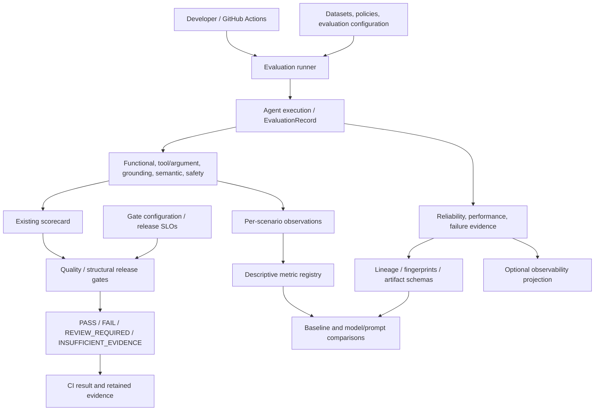

# AgentGuard

**AI Quality Engineering for tool-enabled agents: evidence you can inspect,
quality gates you can explain, and regressions you can reproduce.**

AgentGuard is a reference framework that brings enterprise Quality Engineering
practices to AI systems. It evaluates correctness, tool use, grounding, semantic
quality, safety, reliability, performance, token usage, and release readiness.
The included order-support agent is a concrete test subject, not a claim of
production adoption.

**v1.0 scope: complete.** Release tagging awaits human review. Start with the
[10-minute offline demo](docs/INTERVIEW_DEMO.md), the
[architecture](docs/ARCHITECTURE.md), or the [interview guide](docs/INTERVIEW_GUIDE.md).
The demo uses committed synthetic evidence and needs **no API key**.

## Implemented in v1.0

| Capability | What the repository demonstrates |
|---|---|
| Functional and agent behavior | Deterministic assertions; tool selection, arguments, required-operation/trajectory evidence, and grounded-response validation |
| Semantic quality | LLM-as-judge relevance, correctness, and faithfulness supplement deterministic checks |
| Safety | Separate adversarial/prompt-injection scenarios; tool policy, data protection, unsupported-action and grounding checks |
| Gates and CI/CD | Existing quality gates plus 16 structural/configuration release gates; a GitHub Actions workflow |
| Reliability and performance | Deadlines, explicit retry ownership, failure evidence, bounded concurrency qualification, latency and production-token accounting |
| Lineage and governance | Immutable run manifests/fingerprints, invocation handoff, source-integrity checks, explicit baseline promotion and advisory continuous comparison |
| Observability and regression | Opt-in local observers, OTel-compatible mapping, and offline model/prompt comparison of existing runs |

**2,490+ automated offline tests**, including a 28-case fault matrix, cover these
contracts. Offline evidence is bounded qualification, not a production uptime or
capacity guarantee. Token usage is measured; monetary cost needs explicit,
attributed pricing evidence. See [cost accounting](docs/COST_ENGINEERING.md).

## How it fits together



The metric registry supports descriptive comparisons; it does not replace the
existing scorecard or control gates. Quality PASS is distinct from operational
qualification. Correctness-smoke latency is report-only. Read the
[layer boundaries and design decisions](docs/ARCHITECTURE.md).

## Quick start: Windows PowerShell

Run from the repository root with Python 3.11. Dependency installation needs
package access; the prepared demo itself runs offline.

```powershell
py -3.11 -m venv .venv
.venv/Scripts/python.exe -m pip install -r requirements.txt
.venv/Scripts/python.exe -m pytest tests -q
```

Prepare the committed examples once, then inspect and compare them:

```powershell
New-Item -ItemType Directory -Path reports/evaluations -Force | Out-Null
Copy-Item -Path tests/fixtures/model_prompt_runs/16000000000000000000000000000001,tests/fixtures/model_prompt_runs/16000000000000000000000000000002,examples/portfolio/evaluations/17000000000000000000000000000001,examples/portfolio/evaluations/17000000000000000000000000000002 -Destination reports/evaluations -Recurse
.venv/Scripts/python.exe scripts/inspect_observability.py --run-id 17000000000000000000000000000002 --scenario-id order_status_001
.venv/Scripts/python.exe scripts/compare_model_prompt_runs.py --baseline-run 16000000000000000000000000000001 --candidate-run 16000000000000000000000000000002 --baseline-label fixture-v1 --candidate-label fixture-v2
```

These reserved demo IDs contain **synthetic** outcomes, including intentional
failures. Copy only these example directories; do not substitute live run IDs.
For repeated setup, check existing copies against the committed examples first.
See the [demo](docs/INTERVIEW_DEMO.md) for gate PASS/FAIL, failure retention, and
expected output. No baseline promotion is needed.

### Optional live validation — requires `OPENAI_API_KEY`

Supply the key through your environment or an untracked `.env` based on
`.env.example`. Never commit it. Both commands below execute production models,
judges, and local business tools; they are **not part of the offline demo**.

```powershell
# Applies existing correctness, semantic, safety and token gates.
.venv/Scripts/python.exe scripts/run_agentguard_eval.py --suite smoke

# Adds structural release qualification; requires fresh offline evidence first.
.venv/Scripts/python.exe scripts/run_agentguard_eval.py --suite smoke --release-qualification --structural-evidence reports/release_13e4/transport.json
```

To create the structural evidence on the exact checkout, set
`$env:AGENTGUARD_PRODUCTION_TRANSPORT_REPORT = 'reports/release_13e4/transport.json'`
before the offline test command, and remove that environment variable afterward.
The artifact is write-once: use a fresh filename if it already exists, and pass
that same filename to release qualification. Missing/stale evidence is not PASS.
The [release guide](docs/MILESTONE_13.md) explains applicability and exit codes.

## Enterprise fit and scope

AgentGuard owns AI-quality evidence and decision logic. Enterprise platforms keep
ownership of CI/CD, observability, test management, incidents, artifact storage,
and collaboration. GitHub Actions and local observer contracts exist today;
other enterprise adapters are future work. Continuous evaluation is an explicit
runner invocation plus advisory comparison, not autonomous production monitoring.

The [future enterprise architecture](docs/ENTERPRISE_ARCHITECTURE_V2.md) shows
where OTel exporters, RAG/KnowledgeProvider, MCP/ToolProvider, and enterprise
systems could connect. It separates implemented components from proposals.

## Repository map

| Path | Purpose |
|---|---|
| `src/agent/` | Reference agent, business tools, request policy and runtime reliability |
| `src/agentguard/` | Evaluation, evidence, gates, lineage, observers and comparisons |
| `evals/datasets/` | Versioned functional and safety benchmarks |
| `data/` | Local reference business fixtures |
| `config/` | Policies, gates, execution profiles and artifact schemas |
| `scripts/` | Evaluation, inspection, qualification and comparison CLIs |
| `tests/` | Offline contracts and committed comparison fixtures |
| `examples/portfolio/` | Additional sanitized synthetic demo evidence |
| `baselines/` | Explicitly governed baseline descriptors/snapshots |
| `docs/` | Architecture, implementation evidence and interview narrative |
| `reports/` | Generated artifacts; gitignored |

## Roadmap and release

**v1.0 — COMPLETE:** the implemented scope above is frozen for portfolio/release
review. See [CHANGELOG](CHANGELOG.md); no tag is created by the demo.

**v2.0 — future possibilities, not implemented:** enterprise adapters;
KnowledgeProvider/RAG and RAG evaluation; ToolProvider/MCP; multi-agent evaluation;
broader continuous production evaluation; organization-wide governance; advanced
analytics; and richer policy integration. This is a direction, not a delivery
commitment or a claim about current functionality.
