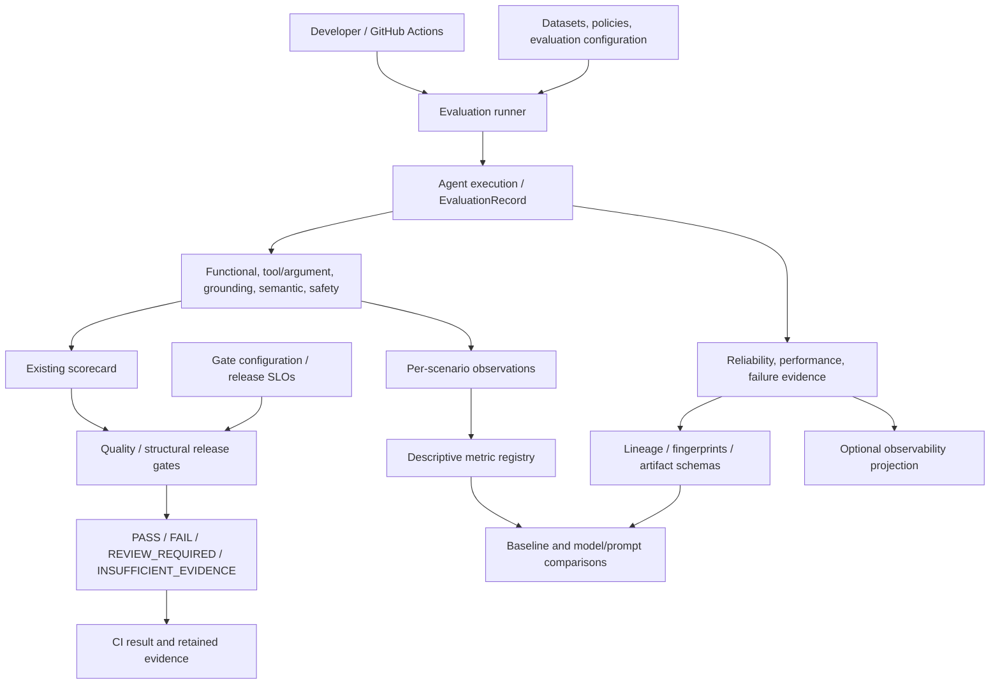

# AgentGuard

**Evaluation, execution evidence and quality gates for tool-enabled agents.**

AgentGuard is an AI evaluation and reliability reference framework for tool-enabled
agents. It evaluates correctness, tool use, grounding, semantic
quality, safety, reliability, performance, token usage, and release readiness.
The included order-support agent is a concrete test subject, not a claim of
production adoption.

The existing `v1.0.0` tag identifies the previously published and qualified
implementation. The upcoming `v1.0.1` release adds public-documentation, licensing
and release-readiness improvements without changing evaluation semantics.
AgentGuard is licensed under the [Apache License 2.0](LICENSE).

`v1.0.1` is in preparation and has not been published. Hosted CI for its final
commit is not yet complete. See the [release review](docs/PUBLIC_RELEASE_REVIEW.md).

Reading path: [project overview](docs/PROJECT_OVERVIEW.md) →
[architecture](docs/ARCHITECTURE.md) → [offline demo](docs/DEMO_GUIDE.md) →
[qualification and release review](docs/PUBLIC_RELEASE_REVIEW.md).
The demo uses committed synthetic evidence and needs **no API key**.

## Implemented in v1.0

| Capability | What the repository demonstrates |
|---|---|
| Functional and agent behavior | Deterministic assertions; tool selection, arguments, required-operation/trajectory evidence, and grounded-response validation |
| Semantic quality | LLM-as-judge relevance, correctness, and faithfulness supplement deterministic checks |
| Safety | Separate adversarial/prompt-injection scenarios; tool policy, data protection, unsupported-action and grounding checks |
| Gates and CI/CD | Existing quality gates plus 16 structural/configuration release gates; a GitHub Actions workflow |
| Reliability and performance | Deadlines, explicit retry ownership, failure evidence, bounded concurrency qualification, latency and production-token accounting |
| Lineage and governance | Immutable run manifests/fingerprints, invocation handoff, source-integrity checks, explicit baseline promotion and advisory continuous comparison |
| Observability and regression | Opt-in local observers, OTel-compatible mapping, and offline model/prompt comparison of existing runs |

The offline suite includes a 28-case fault matrix. Current executed counts and
qualification limits are recorded in the [release review](docs/PUBLIC_RELEASE_REVIEW.md).
Offline evidence is bounded qualification, not a production uptime or
capacity guarantee. Token usage is measured; monetary cost needs explicit,
attributed pricing evidence. See [cost accounting](docs/COST_ENGINEERING.md).

## What is evaluated beyond the final answer

A plausible answer can omit a required operation, call an unauthorized tool, use
incorrect arguments, contradict captured facts, or miss its deadline.
`EvaluationRecord` retains actual calls/results, final output, execution plan,
operation states, planning evidence, usage and timings for separate evaluators.

`evaluate_record` checks required/forbidden text, structured tool arguments,
configured behavior predicates and authoritative facts. Expected calls match
one-to-one **without requiring order**. Extra calls are rejected when outside a
scenario's `allowed_tools`; otherwise the generic scorer permits extras. The
reference runtime separately enforces required operations before synthesis and
records prohibited attempts and failures. This evaluates observable execution,
not private reasoning or an arbitrary expected sequence of tools.

DeepEval judges supplement deterministic checks. Offline tests use doubles and
the demo inspects retained fixtures. Judge-score movement can be noise; paired,
eligible comparisons do not establish statistical significance. V1 has no judge
confidence intervals, noise bands, significance tests or calibration procedure.
See [comparison limits](docs/MODEL_PROMPT_REGRESSION.md).

## How it fits together



The metric registry supports descriptive comparisons; it does not replace the
existing scorecard or control gates. Quality PASS is distinct from operational
qualification. Correctness-smoke latency is report-only. Read the
[layer boundaries and design decisions](docs/ARCHITECTURE.md).

## Quick start: Windows PowerShell

Run from the repository root with Python 3.11. Dependency installation needs
package access; the prepared demo itself runs offline.

```powershell
py -3.11 -m venv .venv
.venv/Scripts/python.exe -m pip install -r requirements.txt
$env:PYTHON_DOTENV_DISABLED = "1"
$env:DEEPEVAL_TELEMETRY_OPT_OUT = "YES"
$env:OPENAI_AGENTS_DISABLE_TRACING = "1"
.venv/Scripts/python.exe -m pytest tests -q
```

Prepare the committed examples once, then inspect and compare them:

```powershell
New-Item -ItemType Directory -Path reports/evaluations -Force | Out-Null
Copy-Item -Path tests/fixtures/model_prompt_runs/16000000000000000000000000000001,tests/fixtures/model_prompt_runs/16000000000000000000000000000002,examples/portfolio/evaluations/17000000000000000000000000000001,examples/portfolio/evaluations/17000000000000000000000000000002 -Destination reports/evaluations -Recurse
.venv/Scripts/python.exe scripts/inspect_observability.py --run-id 17000000000000000000000000000002 --scenario-id order_status_001
.venv/Scripts/python.exe scripts/compare_model_prompt_runs.py --baseline-run 16000000000000000000000000000001 --candidate-run 16000000000000000000000000000002 --baseline-label fixture-v1 --candidate-label fixture-v2
```

These reserved demo IDs contain **synthetic** outcomes, including intentional
failures. Copy only these example directories; do not substitute live run IDs.
For repeated setup, check existing copies against the committed examples first.
See the [demo](docs/DEMO_GUIDE.md) for gate PASS/FAIL, failure retention, and
expected output. No baseline promotion is needed.

### Optional live evaluation

Supply `OPENAI_API_KEY` through the process environment; `.env.example` documents
the variable name. Never print or commit the key. The offline setup disables
`.env` loading. Both commands below execute production models,
judges, and local business tools; they are **not part of the offline demo**.

```powershell
# Applies existing correctness, semantic, safety and token gates.
.venv/Scripts/python.exe scripts/run_agentguard_eval.py --suite smoke

# Adds structural release qualification; requires fresh offline evidence first.
.venv/Scripts/python.exe scripts/run_agentguard_eval.py --suite smoke --release-qualification --structural-evidence reports/release_13e4/transport.json
```

To create the structural evidence on the exact checkout, set
`$env:AGENTGUARD_PRODUCTION_TRANSPORT_REPORT = 'reports/release_13e4/transport.json'`
before the offline test command, and remove that environment variable afterward.
The artifact is write-once: use a fresh filename if it already exists, and pass
that same filename to release qualification. Missing/stale evidence is not PASS.
The [release guide](docs/MILESTONE_13.md) explains applicability and exit codes.

## CI/CD

[GitHub Actions](.github/workflows/agentguard.yml) runs the deterministic suite on
pull requests with Python 3.11, `.env` loading disabled and `contents: read`.
Standard CI needs no credential. Live smoke/structural qualification is an explicit
`workflow_dispatch` opt-in requiring a configured repository secret; its existing
gates and failure exit codes remain unchanged. Only the selected release-evidence
directory is uploaded, including on failure; general reports are not published.
Offline checks do not establish live-provider release quality.

## Enterprise fit and scope

AgentGuard owns AI-quality evidence and decision logic. Enterprise platforms keep
ownership of CI/CD, observability, test management, incidents, artifact storage,
and collaboration. GitHub Actions and local observer contracts exist today;
other enterprise adapters are future work. Continuous evaluation is an explicit
runner invocation plus advisory comparison, not autonomous production monitoring.

The [future enterprise architecture](docs/ENTERPRISE_ARCHITECTURE_V2.md) shows
where OTel exporters, RAG/KnowledgeProvider, MCP/ToolProvider, and enterprise
systems could connect. It separates implemented components from proposals.

## Repository map

| Path | Purpose |
|---|---|
| `src/agent/` | Reference agent, business tools, request policy and runtime reliability |
| `src/agentguard/` | Evaluation, evidence, gates, lineage, observers and comparisons |
| `evals/datasets/` | Versioned functional and safety benchmarks |
| `data/` | Local reference business fixtures |
| `config/` | Policies, gates, execution profiles and artifact schemas |
| `scripts/` | Evaluation, inspection, qualification and comparison CLIs |
| `tests/` | Offline contracts and committed comparison fixtures |
| `examples/portfolio/` | Additional sanitized synthetic demo evidence |
| `baselines/` | Explicitly governed baseline descriptors/snapshots |
| `docs/` | Architecture, implementation evidence and technical guides |
| `reports/` | Generated artifacts; gitignored |

## Roadmap and release

**v1.0.0 — historical:** the existing published tag identifies the qualified
implementation; it remains unchanged.

**v1.0.1 — upcoming:** public documentation, Apache-2.0 licensing and release
preparation, including the previously reviewed CI live-evaluation opt-in correction.
No runtime or evaluation capabilities are added. Final-commit hosted CI remains
outstanding. See [CHANGELOG](CHANGELOG.md) and the
[release review](docs/PUBLIC_RELEASE_REVIEW.md).

**v2.0 — future possibilities, not implemented:** enterprise adapters;
KnowledgeProvider/RAG and RAG evaluation; ToolProvider/MCP; multi-agent evaluation;
broader continuous production evaluation; organization-wide governance; advanced
analytics; and richer policy integration. This is a direction, not a delivery
commitment or a claim about current functionality.
