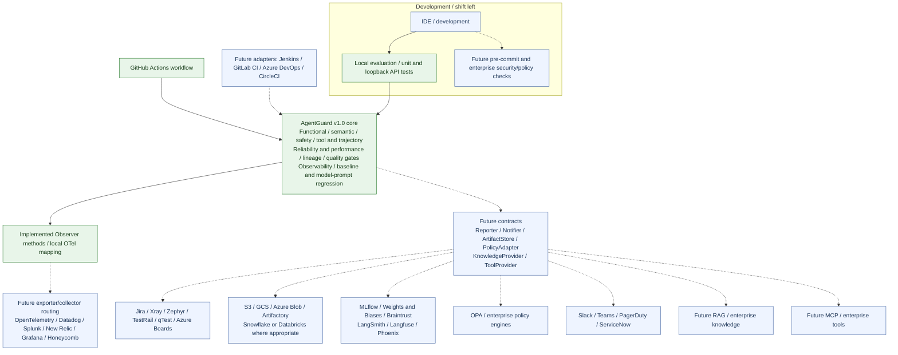
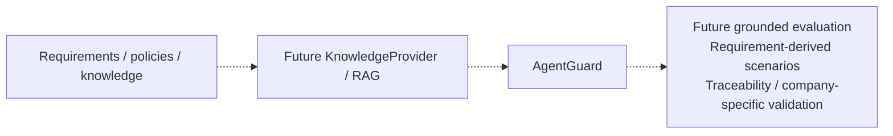
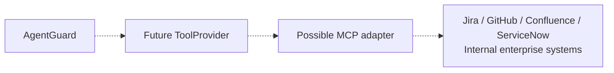
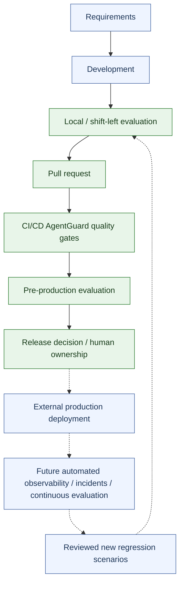

# Future enterprise reference architecture: v1.0 to v2.0

**This is a future reference architecture, not an implemented integration catalog.**
Green nodes identify implemented v1.0 capabilities. Blue nodes and dashed edges
identify proposed extensions or external systems; their inclusion is not a claim
of a working adapter.

> AgentGuard owns AI-quality evidence and decision logic. Existing enterprise
> platforms continue to own CI/CD, observability, test management, incident
> management, artifact storage, collaboration and other operational workflows.



## Stable contracts, company-specific adapters

The goal is **AgentGuard core → stable extension contracts → company-specific
adapters**. Only the observer interface is implemented today; the other interface
names below are proposals, not existing Python classes or configuration options.

| Contract | Intended responsibility | Current status |
|---|---|---|
| Observer | Export sanitized spans, metrics and evaluation events | Local interface/exporters and OTel mapping implemented; SDK/vendor transport is future |
| Reporter | Publish test/quality evidence into test-management or AI-engineering systems | Future |
| Notifier | Route reviewed findings to collaboration or incident systems | Future |
| ArtifactStore | Persist and retrieve versioned, access-controlled evidence | Future; v1 uses local artifacts |
| PolicyAdapter | Resolve attributed enterprise quality/security policy | Future; v1 uses checked-in policies |
| KnowledgeProvider | Supply governed documents and retrieval evidence | Future |
| ToolProvider | Expose approved external capabilities, possibly through MCP | Future |

Adapters should preserve lineage, availability, privacy and decision authority.
Backend delivery errors must not fabricate a quality result. Enterprises decide
where test results, incidents and artifacts belong; AgentGuard does not replace
those systems.

The following is an **architectural example only**. No current configuration
loader accepts this adapter-selection document:

```yaml
observability: opentelemetry
ci_provider: github
test_management: xray
defect_management: jira
artifact_store: s3
policy_engine: opa
experiment_platform: mlflow
knowledge_provider: enterprise_rag
tool_provider: mcp
notifications: slack
```

## KnowledgeProvider / RAG — v2.0 only

Potential sources include requirements, acceptance criteria, architecture documents,
API specifications, company policies, security standards, regulatory requirements,
runbooks, historical incidents, defects and release documentation.



Retrieval must retain document provenance, version/fingerprint, access controls,
retrieved passages/evidence, source freshness and reproducibility information.
Benchmarks derived from documents would need review and versioning before use.
v1's grounded-response checks validate captured tool facts; they are **not RAG**.
Neither retrieval nor RAG evaluation is implemented in this repository.

## ToolProvider / MCP — v2.0 only



Where suitable MCP servers exist, a future adapter could reduce point-to-point
coupling. MCP alone would not establish authorization or trust. Required controls
include least privilege, tool allowlists, argument/schema validation,
authentication scopes, explicit approval boundaries, audit evidence,
prompt-injection resistance and safe failure handling. Existing local business
tools are not MCP integrations. No MCP client/server or enterprise connector is
implemented here.

## Shift left to shift right



Green lifecycle nodes mean v1 supplies supporting commands/evidence, not a complete
enterprise service: local tests, PR workflow, explicit evaluation, gates, lineage,
baseline governance and regression comparison already demonstrate shift left.
Production deployment, incident ingestion, automatic scenario generation and a
continuous monitoring feedback loop remain external/future. v1 continuous
evaluation is an explicit invocation, not a background production scheduler.
