# Runtime capability policy

Milestone 12 separates planning, authorization, execution and answer synthesis.
Authorized required operations execute deterministically before the support model
runs. The support model receives `tools=[]` and projected authoritative results;
it cannot initiate or suppress required tool execution.

The registry also exposes read-only action capability metadata to the
[unsupported-action evaluator](ACTION_CLAIMS.md). That consumer cannot change
runtime routing or tool execution.

```mermaid
flowchart LR
    Request[User request] --> Entities[Deterministic domain entity extraction]
    Entities --> Router[Tool-free semantic analysis]
    Router --> Decision[Primary plan: bindings, controls, disclosures and ambiguity]
    Decision --> Review[Completeness validation and at most one recovery call]
    Review --> Policy[Deterministic minimum authoritative cover per target]
    Policy --> Plan[ExecutionPlan with required operations]
    Plan --> Execute[Deterministic authoritative execution]
    Execute --> Internal[Internal business result]
    Internal --> Projection[Capability field projection]
    Projection --> Ready[Required-operation completion check]
    Execute -->|No required operations| Ready
    Execute -->|Failure| Blocked[Explicit failure; no synthesis]
    Review -->|Review failure| Blocked
    Ready --> Agent["Support synthesis: tools=[]"]
    Request --> Agent
    Agent --> Record[Captured execution]
    Record --> Evaluation[Independent trajectory and quality checks]
```

## Responsibilities

- `src/agent/domain_entities.py`: parses order identifiers from the complete input
  before any semantic analysis, preserving identifiers in quoted/control text.
- `src/agent/capability_router.py`: uses `output_type=CapabilityPlanOutput` to
  classify per-component capability/target bindings, denied disclosures,
  confidence and control signals in one model call. The model references
  previously extracted IDs; it cannot introduce IDs absent from the input.
  `RequestPlan` (`RoutingDecision` compatibility alias) combines that analysis with deterministic `extracted_entities`
  and an explicit ambiguity state. The router has no tools, handoffs or scenario
  metadata. Its catalog has semantic descriptions, not literal prompt examples.
  `SemanticRoutingAnalysis` is an internal compatibility representation, not the
  production model's output schema.
- `src/agent/planning_completeness.py`: reviews structurally suspicious empty
  plans with at most one tool-free recovery call. Validated recovery emits
  capabilities, targets and clarification requirements, never tool permissions.
- `src/agentguard/tool_policy.py`: owns capability contracts and tool metadata.
  The pure resolver accepts structured intent, never a user prompt or scenario ID.
- `src/agent/request_policy.py`: composes independent capability components into
  per-order grants using the existing minimum-cover resolver.
- `src/agent/execution_plan.py`: converts grants into required operations,
  executes each at most once, projects results, and blocks synthesis if a
  required operation remains unresolved.
- `src/agent/data_policy.py`: copies only registry-authorized scalar facts to
  agent-visible tool results. See [privacy and minimization](PRIVACY_DATA_POLICY.md).
- `src/agent/support_agent.py`: routes, validates completeness, resolves policy,
  and completes required reads before running answer synthesis. Both the template
  and per-request support clone have `tools=[]`. The synthesis hook rejects
  model-requested function calls.
- `src/agent/tools/orders.py`: unchanged deterministic business implementation.
- `src/agentguard/scoring.py`: independently verifies dataset expectations after
  capture. Unexpected-tool diagnostics list unexpected, allowed and actual tools.
  Safety evaluation remains separate and does not determine runtime permissions.

## Business data, intent and control separation

The identifier parser recognizes standalone ASCII `ORD-` followed by one or more
ASCII digits. It normalizes case to uppercase and deduplicates in first-occurrence
order. Surrounding punctuation/whitespace is permitted; partial, hyphen-extended,
alphanumeric or decimal tokens are not accepted as identifiers. It never reads
fixtures or assumes an ID exists. Only an authoritative business tool can establish
existence and facts. No particular identifier or control-message delimiter is
special-cased.

The router receives an envelope containing the original `user_text` and parsed
`extracted_entities`. Semantic capability requests bind to IDs in that parsed list;
the router and policy boundary reject invented targets. Business-intent confidence and
ambiguity are assessed separately from control signals. Control signals include
instruction override, fake system/developer authority, tool suppression, fabricated
tool results and unsupported authority claims. They are runtime observations, not
post-execution safety verdicts, and cannot grant authority or disable required
verification. They are retained in planning diagnostics and can identify an empty
plan that needs completeness review. Once policy creates required operations,
runtime execution enforces verification independently of the support model.

- One unique ID remains available even if it appears only in adversarial text;
  its presence alone does not authorize a lookup.
- A supported request with no resolved required ID produces no required business
  operation and needs clarification.
- Multiple IDs can have distinct semantic roles. Explicit components bind each
  capability to its legitimate target without including disclosure-only references.
  Unresolved components request clarification; clear independent components proceed.
  Older injected routers without component bindings retain the conservative
  `entity_scope=all` requirement for multiple IDs.
- Genuine uncertainty about the business outcome yields `business_intent`, even
  with a unique ID. Unknown capabilities and low confidence still fail closed.

The support model receives the original user message plus input history of actual
runtime function calls and their projected outputs. User-provided JSON or alleged
tool results remain untrusted user content. Disclosure and clarification notes
reflect runtime policy. There is no identifier-only instruction note or model tool
selection phase. Entity extraction adds no model call. Business/control
classification remains semantic; mocked offline tests do not establish live model
classification accuracy.

## Planning completeness

An explicit empty binding list with recognized targets, control signals and no
known ambiguity warrants a bounded semantic review. Existing bindings, legacy
plans without an explicit binding contract, missing targets, known ambiguity,
unbound multiple targets without `entity_scope=all`, and absent control signals
skip recovery. High primary-router confidence does not prove completeness.

The reviewer asks whether legitimate supported business work remains after
disregarding fabricated claims and untrusted control instructions. It may return
an empty list for hypothetical examples, quotations, documentation, mere references,
disclosure-only requests or unsupported transactions. Registry tool/capability
references are review evidence, not permission to execute.

Recovered capabilities must be registered and permit business tools; targets must
come from the original extracted entities. Primary confidence, control signals and
denied disclosures are preserved. Recovery cannot clear existing ambiguity or
authorize tools. The final plan still passes through ordinary runtime policy.
There is no recursive recovery. Invalid recovery output or a review exception
raises `PlanningCompletenessError` before authorization and synthesis. See
[planning completeness](planning_completeness.md) for telemetry and boundaries.

## Authority and selection

Each tool declares `supports`, `authoritative_for`, and `provides`. Field names
describe the possible output contract; missing orders and nullable fields still
follow the existing business tools. The registry does not predict eligibility,
read fixtures, copy return-window logic, or assert that every field is populated.

`check_return_eligibility` includes the original authoritative order lookup in its
result. Its registry entry therefore covers both eligibility and status. This is
an explicit authority declaration, not an inference from a coincidentally shared
field name.

| Requested capabilities for a resolved target | Required runtime operations |
| --- | --- |
| order_status | get_order_status |
| return_eligibility | check_return_eligibility |
| order_status + return_eligibility | check_return_eligibility |
| unsupported_action alone | none |
| unsupported_action + order_status | get_order_status; no action tool |
| unknown, ambiguous, confidence below 0.80, or missing required order ID | none; clarify |

The resolver enumerates candidate subsets in increasing tool-count order. Each
requested capability needs a tool that has both declared authority and all of its
required facts, and those facts must survive the capability's disclosure projection.
The component policy resolves this cover separately for each target. Equal-size solutions prefer fewer unrequested capabilities, then
fewer extra facts, then stable name order. Thus status-only requests choose the
narrower status tool, while combined requests need only the eligibility tool.
This exact cover search is appropriate for the small registry; a substantially
larger registry may need a solver that preserves the same selection contract.

Authorization is scoped to each tool/target grant. A tool is also reported as
redundant when its returned information is already covered by the selected tools.
The same tool can have distinct operations for different authorized orders; one
target's grant never permits a lookup on another target. The execution layer
rejects operations outside its plan.

Unknown or unfulfillable capabilities never trigger an all-tools fallback.
Router transport errors or invalid structured outputs raise `CapabilityRoutingError`
before support execution, without exposing the underlying exception text or
retrying the support agent. Low-confidence plans authorize no business operations. Incomplete
components ask for clarification while separately authorized components can proceed.

## Required execution and support synthesis

`build_execution_plan()` uses the resolved grants rather than inferring intent or
selecting tools again. Each current authorized read becomes a `REQUIRED` operation
with bound arguments and capability context. The abstraction also supports
`OPTIONAL` and `PROHIBITED`; current policy does not emit optional reads.

`execute_required()` invokes the authoritative business functions directly before
the support `Runner.run_sync` call. Internal results pass through
`project_tool_result()` using the grant's capabilities before entering telemetry
or model input. The runtime checks required-operation completion before synthesis;
the model does not decide whether to verify a resolved business request.

A successful authoritative read returning `found=false` completes its obligation.
A missing implementation, tool exception or projection failure leaves the
operation unresolved and raises `ExecutionFailure`; no support answer is accepted.
There is no application retry or model continuation for required execution.

Synthesis uses a fresh agent clone with `tools=[]` and one permitted SDK turn. Its
job is to explain the projected facts, handle clarification, and refuse prohibited
portions of the request. If it attempts a function call, `_SynthesisHooks` records
the prohibited attempt and raises `ExecutionFailure`. The model cannot initiate,
repeat or suppress required execution. Independent evaluation still checks whether
planning and the final answer were correct. See [required execution](required_execution.md).

## Capture and accounting

`RunResult.context_wrapper.context` holds the execution trace and planning
diagnostics. Runtime calls and projected results are supplied as input history;
`RunResult.new_items` contains only SDK-generated support activity. Capture reads
the runtime trace explicitly, so completed deterministic calls are recorded even
though the model did not generate them.

`EvaluationRecord.execution` distinguishes required, completed, missing and optional
operations and prohibited attempts. `EvaluationRecord.planning` records primary,
recovery and final plans. Captured execution/planning failures have an explicit
error and no accepted final answer; the release runner fails before judging them.

Production usage includes primary routing, any bounded recovery and support
synthesis, aggregated once with `Usage.add`. A normal resolved request uses two
model responses; a triggered review adds one. Direct tools consume no inference
tokens. The capture timer covers the whole production path; evaluation-only judge
calls remain outside those token and latency totals. Recovery is separately
identified as `planning_recovery` in token diagnostics.

## Extension and testing

To add a capability, define its description, required facts, exposed fields and
applicability in the runtime catalog. Register the authoritative tool's supported
capabilities, returned facts and performed actions. For the current order domain,
provide the deterministic callable under its registered name in
`src/agent/tools/orders.py`; the runtime implementation resolver looks it up there.
The current plan builder binds `order_id` arguments from policy grants. A different
entity domain or argument contract needs explicit binding and implementation
resolution support, not model-selected tool calls.

Verify that normal policy resolves the minimum cover, required facts survive
projection, and each required operation completes exactly once before synthesis.
Keep synthesis tool-free. The removed `scoped_tool()` path is not an extension
point, and registering an SDK wrapper in `BUSINESS_TOOLS` does not connect a tool
to current runtime dispatch. No scenario IDs or phrase-specific routing branches
belong in capability extensions.

`SemanticCapabilityRouter(run=...)` accepts a mocked structured-output runner.
`run_support_agent_detailed(..., router=..., recovery_planner=...)` accepts injected
planners. `SemanticRecoveryPlanner(run=...)` accepts a mocked recovery runner.
Policy tests require no SDK execution. Offline integration tests cover bounded
recovery, valid empty plans, minimal tool sets, projection, execution failures,
completion before synthesis, prohibited model calls, and production usage. Scripted
SDK models run with tracing disabled and make no external API calls.

## Dataset expectation audit

Strict scoring requirements were preserved. Three stale dataset expectations,
`tool_routing_001`, `grounded_response_005`, and `missing_order_003`, were corrected
after auditing all 70 cases. Each now requires and allows only
`check_return_eligibility`; its structured facts preserve both requested outcomes
(delivered/eligible, processing/ineligible, or not found/ineligible). Coverage tags
record `multi_intent`, `minimal_tool_set`, and `capability_coverage`.

The offline dataset audit checks each required trajectory against the capability
registry and verifies fact/tool associations, including distinct calls for multiple
orders. No other scenario required correction. Regression tests verify that all
three corrected trajectories pass and adding `get_order_status` fails. Scoring,
safety evaluation and release gates are unchanged. Runtime code never imports the
dataset. No live evaluation was run here.
